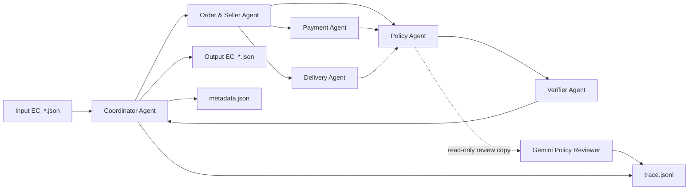

# Kiến trúc Multi-Agent E-commerce Dispute Resolution

## 1. Mục tiêu thiết kế

Pipeline xử lý 50 case Olist theo `EC_POLICY_V1`. Kết luận nghiệp vụ, phép
tính tiền và evidence được dựng bằng code deterministic từ CSV. LLM chỉ là
reviewer độc lập; kết quả LLM không được sửa dữ liệu hay quyết định cuối.

Thiết kế này bảo đảm:

- cùng input luôn tạo cùng output;
- không hallucinate order, seller, payment hoặc sự kiện vận chuyển;
- mọi số tiền truy ngược được về CSV;
- lỗi API không chặn việc sinh output đúng policy;
- trace thể hiện phân công và handoff thật giữa các agent.

## 2. Sơ đồ agent và handoff



## 3. Vai trò và quyền truy cập

### Coordinator Agent

- Đọc input case.
- Gọi agent theo đúng thứ tự.
- Không tự tính nghiệp vụ.
- Chỉ ghi output sau khi Verifier pass.
- Ghi toàn bộ event vào trace mới; không append trace cũ.

### Order & Seller Agent

- Đọc `olist_orders_dataset.csv`, `olist_order_items_dataset.csv` và seller
  index.
- Tính item total, freight total.
- Xác định seller bàn giao trễ bằng
  `order_delivered_carrier_date > shipping_limit_date`.
- Handoff order status, item IDs, seller IDs, shipping limits và totals.

### Payment Agent

- Đọc `olist_order_payments_dataset.csv` theo `order_id`.
- Cộng mọi `payment_value`; không nhân với installments.
- So sánh payment total với item total + freight trong sai số 0.10 BRL.
- Xác định split payment khi có ít nhất 2 payment row.

### Delivery Agent

- Nhận order handoff.
- So sánh delivered customer date với estimated delivery date.
- Handoff `delivered_late` và `seller_handoff_late`.

### Policy Agent

- Không đọc CSV trực tiếp.
- Nhận ba handoff phía trên.
- Áp dụng policy theo thứ tự: canceled, unavailable, late seller, late
  logistics, valid split payment, unsupported late claim.
- Trả issue, root cause, responsible party, refund, action và confidence.

### Gemini Policy Reviewer Agent

- Model: `gemini-2.5-flash-lite` qua Google Generative Language API.
- Chỉ nhận facts đã chuẩn hóa và quyết định deterministic.
- Trả `agree` hoặc `disagree` cùng lý do ngắn.
- Không có quyền thay đổi output.
- API key chỉ đọc từ `.env`; key không xuất hiện trong trace.

### Verifier Agent

- Kiểm tra schema, enum, giới hạn số lượng.
- Kiểm tra entity và evidence tồn tại trong CSV.
- Tính lại financial fields và refund.
- Chặn ghi file nếu có bất kỳ sai lệch nào.

## 4. Handoff contract

Mỗi event trace có cấu trúc:

```json
{
  "run_id": "<uuid>",
  "sequence": 1,
  "timestamp": "<UTC ISO-8601>",
  "case_id": "EC_001",
  "agent": "OrderSellerAgent",
  "event": "handoff_completed",
  "input_from": "CoordinatorAgent",
  "payload": {}
}
```

Payload chỉ chứa dữ liệu cần kiểm chứng, kết quả tính toán và ID tồn tại.
Không chứa API key, `.env`, prompt bí mật hoặc chain-of-thought.

## 5. Tính đúng và xử lý lỗi

- Tiền dùng `Decimal`, làm tròn 2 chữ số bằng `ROUND_HALF_UP`.
- Confidence cố định `0.99`: policy deterministic chạy trên facts đầy đủ và được
  Verifier đối chiếu lại; vẫn giữ biên `0.01` cho chất lượng dữ liệu nguồn.
- Timestamp dùng trực tiếp giá trị CSV, không đổi múi giờ.
- Missing item row tạo item/seller rỗng và item/freight bằng `0.0`.
- Case không khớp sáu rule bị fail; không tự tạo fallback issue.
- Gemini timeout/rate limit được retry tối đa 3 lần. Sau đó review ghi `error`,
  deterministic output vẫn được verifier kiểm tra và ghi bình thường.
- Reviewer dùng temperature `0.0` và truth table đầy đủ để tránh diễn giải sai
  `unsupported_late_claim` hoặc gán việc giao hàng cho customer.
- JSON parser đọc object hợp lệ đầu tiên, chấp nhận markdown fence và bỏ trailing
  noise do API lặp text; response giới hạn 128 token.
- File JSON ghi qua file tạm rồi replace để tránh artifact dang dở.
- Evidence gồm order, toàn bộ item/payment row tạo các trường entity và tài chính,
  cùng policy áp dụng; `seller:*` chỉ xuất hiện khi seller là responsible party.
- Candidate output được dựng trước khi gọi Gemini. ReviewResult chỉ ghi telemetry,
  không được truyền vào `build_output`; SHA-256 từng output được lưu trong trace.
- `--validate-only` tải lại CSV và chạy lại toàn bộ agent/policy để kiểm semantic,
  không chỉ kiểm JSON parse.
- Sau khi tạo `output.zip`, pipeline xác nhận đúng 50 JSON ở root và từng entry
  giống byte với file đã được Verifier duyệt trong `output/`.

## 6. Runtime và bảo mật

- Python 3.10+, standard library only.
- Model mặc định khai báo trong source và `.env.example`.
- `.env` bị Git ignore.
- `output.zip` chỉ chứa 50 JSON, không chứa source, trace hoặc secret.
- Parameter count của Gemini 2.5 Flash-Lite không được Google công bố; metadata
  ghi trạng thái compliance là `not independently verifiable`.
