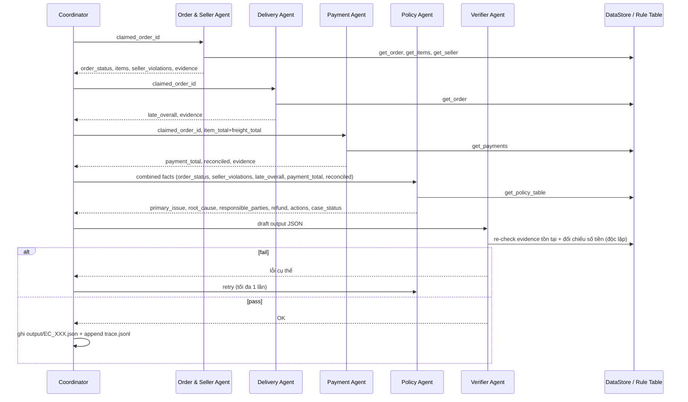

# Architecture — Multi-Agent E-commerce Dispute Resolution

## 1. Nguyên tắc thiết kế

Output schema (README mục 6) không có field text tự do — toàn bộ là enum, ID, số. Và toàn bộ bảng quy tắc (README mục 4) chỉ phụ thuộc vào `claimed_order_id` → dữ liệu CSV; nội dung khiếu nại của khách hàng không làm thay đổi rule nào được áp dụng.

Vì vậy kiến trúc theo nguyên tắc **deterministic core + LLM orchestration mỏng**:

- Mọi phép join, tính tổng tiền, so sánh ngày, dựng evidence ID → code Python thuần, không đi qua LLM.
- Agent LLM (≤10B, qua API provider) chỉ làm nhiệm vụ: gọi đúng tool, diễn giải kết quả tool thành nhận định domain để handoff cho agent kế tiếp, và gán `confidence`.
- Verifier chạy độc lập, đối chiếu lại toàn bộ evidence/số tiền với dữ liệu gốc trước khi cho phép ghi file — không agent nào tự chấm bài của chính nó.

Hệ quả: 55% trọng số chấm điểm (entities 20% + evidence 15% + financial 20%) phụ thuộc vào độ chính xác của tầng dữ liệu (deterministic), không phụ thuộc vào khả năng suy luận của model nhỏ.

### 2 quyết định kiến trúc đã chốt

| Quyết định | Lựa chọn | Lý do |
|---|---|---|
| A2A protocol | **Mô phỏng in-process** (agent = function/class riêng, handoff qua object + log `trace.jsonl`), không dùng A2A SDK/HTTP service thật | Đủ để thoả yêu cầu "có phân công, handoff, verify giữa agent" (README mục 7) trong khung giờ thi giới hạn; A2A protocol thật (AgentCard, JSON-RPC) không cần thiết cho quy mô 50 case |
| Model hosting | **API provider** (Groq) thay vì local Ollama | Máy chạy không có Ollama/GPU setup sẵn; API ổn định hơn cho ~250 lượt gọi trong khung giờ thi |

## 2. Sơ đồ agent



Coordinator là **hub**: mọi agent chỉ giao tiếp với Coordinator, không nói thẳng với nhau. Thứ tự gọi cố định 1→5 (Order&Seller → Delivery → Payment → Policy → Verifier) vì Payment cần `item_total+freight_total` từ Order&Seller, và Policy cần kết quả của cả 3 agent trước.

## 3. Vai trò & quyền truy cập từng agent

| Agent | Input nhận | Quyền truy cập (tool) | Output handoff | Việc LLM thực sự làm |
|---|---|---|---|---|
| **Coordinator** | case JSON gốc (`case_id`, `claimed_order_id`, `customer_request`) | không truy CSV trực tiếp | gọi tuần tự agent, gộp `CaseFile`, ghi `output/EC_XXX.json` | điều phối, giải quyết xung đột confidence nếu tín hiệu mâu thuẫn |
| **Order & Seller Agent** | `claimed_order_id` | `orders.csv`, `order_items.csv`, `sellers.csv` (read-only) | `order_status`, danh sách item, seller nào vi phạm `shipping_limit_date` (so với `order_delivered_carrier_date` của item thuộc seller đó), evidence `order:`/`item:`/`seller:` | diễn giải seller nào vi phạm khi nhiều seller/item trong 1 order |
| **Delivery Agent** | `claimed_order_id` | `orders.csv` (read-only) | so sánh `order_delivered_customer_date` vs `order_estimated_delivery_date` → `late_overall` (bool) | xác nhận kết quả so sánh, không cần suy luận phức tạp |
| **Payment Agent** | `claimed_order_id`, `item_total+freight_total` (từ Order&Seller) | `order_payments.csv` (read-only) | `payment_total`, số dòng payment, `reconciled` (khớp trong ±0.10 BRL), evidence `payment:` | diễn giải kết quả đối soát |
| **Policy Agent** | facts tổng hợp từ 3 agent trên | tool `get_policy_table` (bảng mục 4, không dựa vào trí nhớ model) | `primary_issue`, `root_cause` (ranked), `responsible_parties`, `recommended_refund_brl`, `resolution_actions`, `case_status` | áp bảng **đúng thứ tự ưu tiên** (if/elif, first-match-wins — không tìm "best match"); nêu root cause phụ nếu có |
| **Verifier Agent** | draft output + con trỏ dữ liệu gốc | toàn bộ CSV (read-only, để re-check độc lập) | pass / fail + danh sách lỗi cụ thể | phần lớn là code validator thuần; LLM chỉ viết ghi chú audit ngắn |

Tất cả agent truy cập CSV **read-only** qua `data_access/data_store.py` — không agent nào ghi vào `data/`.

## 4. Luồng handoff chi tiết (per case)

`CaseFile` (pydantic model) chảy xuyên suốt pipeline, mỗi agent append đúng phần của mình:

```
CaseFile
 ├─ case_id, claimed_order_id, opened_at, policy_version
 ├─ order_seller_findings   ← Order & Seller Agent
 ├─ delivery_findings       ← Delivery Agent
 ├─ payment_findings        ← Payment Agent
 ├─ policy_decision         ← Policy Agent
 ├─ verification            ← Verifier Agent (passed / errors / corrections)
 └─ final_output            ← Coordinator (đúng schema mục 6)
```

Mỗi lần append là 1 sự kiện "A2A message", ghi thành 1 dòng `trace.jsonl`:

```jsonl
{"ts": "...", "case_id": "EC_001", "from": "coordinator", "to": "order_seller_agent", "type": "request", "payload": {...}}
{"ts": "...", "case_id": "EC_001", "from": "order_seller_agent", "to": "coordinator", "type": "finding", "payload": {...}}
```

## 5. Data plane (không phải agent — hạ tầng dùng chung)

`data_access/data_store.py`: load 9 CSV một lần khi khởi động, index theo `order_id` / `seller_id` / `product_id`. Expose thành tool cho agent gọi; tool trả về dữ liệu thô **kèm sẵn evidence ID đã format đúng chuẩn README mục 5**, agent không tự gõ tay ID:

```
get_order(order_id)      -> order row + "order:<id>"
get_items(order_id)      -> [item rows] + "item:<id>:<n>" mỗi dòng
get_payments(order_id)   -> [payment rows] + "payment:<id>:<seq>" mỗi dòng
get_seller(seller_id)    -> seller row + "seller:<id>"
get_policy_table()       -> bảng mục 4 dạng literal (Policy Agent dùng, tránh model nhớ sai rule)
```

`data_access/evidence.py`: hàm dựng evidence ID duy nhất trong hệ thống — mọi agent phải đi qua đây, không tự concat string.

## 6. Verifier gate — chốt trước khi ghi file

Kiểm tra độc lập với agent đã tạo ra draft (tránh tự chấm bài mình):

- Mọi `evidence_ids` resolve được về dòng CSV thật, đúng format mục 5
- `item_total_brl + freight_total_brl` khớp tổng `order_items` thật; `payment_total_brl` khớp tổng `order_payments` thật
- `recommended_refund_brl` đúng công thức theo `primary_issue` đã chọn (làm tròn 2 chữ số thập phân)
- Giới hạn mảng: ≤5 entity/set, ≤10 evidence, ≤3 root causes, ≤3 responsible parties, ≤5 actions
- `confidence ∈ [0, 1]`, `case_status ∈ {action_required, no_action}`

Fail → bounce về Policy Agent, tối đa **1 lần retry**. Fail lần 2 → fallback an toàn: chọn `case_status` hợp lý nhất dựa trên phần dữ liệu chắc chắn, `confidence` thấp, **không bao giờ ghi JSON sai schema** (tránh hard gate = 0 điểm).

## 7. Edge cases

| Tình huống | Xử lý |
|---|---|
| `claimed_order_id` không tồn tại trong `orders.csv` | Coordinator dừng sớm sau Order&Seller Agent, `case_status: no_action`, `confidence` thấp, entities/evidence rỗng, log rõ anomaly vào trace |
| Order không có item row | `item_ids`, `seller_ids` rỗng; `item_total_brl`, `freight_total_brl` = `0.0` (đúng README mục 6) |
| Nhiều seller, chỉ một số vi phạm | `responsible_parties` chỉ liệt kê seller vi phạm (≤3), không liệt kê seller giao đúng hạn |
| Nhiều dòng payment, khớp tổng | ưu tiên `valid_split_payment` (đứng trước `unsupported_late_claim` trong bảng mục 4) nếu không rơi vào rule late-delivery/canceled/unavailable trước đó |

## 8. Trace & metadata

- `trace.jsonl` (root): ghi mỗi lượt chạy thật của 50 case — mỗi handoff giữa agent là 1 dòng, không append giữa các lần chạy (ghi đè lượt chạy mới nhất).
- `metadata.json` (root): tên model, số tham số, framework, runtime cho từng agent — khai báo khớp với model name hard-code trong `llm/client.py`.

## 9. Cấu trúc thư mục

```
K3-Day9-Multi-Agent-A2A/
├── agents/
│   ├── coordinator.py
│   ├── order_seller_agent.py
│   ├── delivery_agent.py
│   ├── payment_agent.py
│   ├── policy_agent.py
│   └── verifier_agent.py
├── data_access/
│   ├── data_store.py       # load + index 9 CSV
│   └── evidence.py         # build evidence ID đúng format mục 5
├── llm/
│   ├── client.py           # wrapper Groq
│   └── prompts/
├── schema/
│   └── output_schema.py    # pydantic, enforce giới hạn mục 6
├── pipeline/
│   ├── run_case.py
│   └── run_batch.py        # loop input/*.json -> output/*.json
├── data/                    # 9 CSV Olist (đã có)
├── input/                   # EC_001–EC_050.json (đã có)
├── output/                  # 50 JSON kết quả
├── main.py
├── architecture.md          # file này
├── metadata.json
├── trace.jsonl
└── .env                     # API key, gitignored
```

## 10. Model / provider

Groq — `llama-3.1-8b-instant` (8B tham số) cho tất cả agent, khai báo rõ trong `llm/client.py` và khớp với `metadata.json`. Backup: OpenRouter `qwen2.5-7b-instruct` nếu cần đa dạng hoá model giữa các agent.
