# Architecture — Multi-Agent E-commerce Dispute Resolution

## 1. Nguyên tắc thiết kế

Output schema (README mục 6) không có field text tự do — toàn bộ là enum, ID, số. Và toàn bộ bảng quy tắc (README mục 4) chỉ phụ thuộc vào `claimed_order_id` → dữ liệu CSV; nội dung khiếu nại của khách hàng không làm thay đổi rule nào được áp dụng.

Vì vậy kiến trúc theo nguyên tắc **deterministic core + LLM orchestration mỏng**:

- Mọi phép join, tính tổng tiền, so sánh ngày, dựng evidence ID → code Python thuần, không đi qua LLM.
- Agent LLM (≤10B, qua API provider) diễn giải kết quả tool thành nhận định domain để handoff, và đóng vai người soát lần hai. Quyền của LLM bị giới hạn có chủ đích: **được raise cờ nghi ngờ và hạ confidence, không được đổi kết luận, không được nâng confidence, không được sinh root cause.**
- Verifier chạy độc lập, đối chiếu lại toàn bộ evidence/số tiền với dữ liệu gốc trước khi cho phép ghi file — không agent nào tự chấm bài của chính nó.

Lý do siết quyền LLM (đo từ dữ liệu thật, xem mục 11): bộ 50 case map sạch vào đúng một rule mỗi case. Trong bối cảnh đó, mọi "đóng góp sáng tạo" của model 8B — thêm root cause phụ, tự tin hơn mức dữ liệu cho phép — chỉ có thể làm giảm precision chứ không thể tăng điểm.

Hệ quả: 55% trọng số chấm điểm (entities 20% + evidence 15% + financial 20%) phụ thuộc vào độ chính xác của tầng dữ liệu (deterministic), không phụ thuộc vào khả năng suy luận của model nhỏ.

### 2 quyết định kiến trúc đã chốt

| Quyết định | Lựa chọn                                                                                                                                         | Lý do                                                                                                                                                                                                    |
| ------------- | -------------------------------------------------------------------------------------------------------------------------------------------------- | --------------------------------------------------------------------------------------------------------------------------------------------------------------------------------------------------------- |
| A2A protocol  | **Mô phỏng in-process** (agent = function/class riêng, handoff qua object + log `trace.jsonl`), không dùng A2A SDK/HTTP service thật | Đủ để thoả yêu cầu "có phân công, handoff, verify giữa agent" (README mục 7) trong khung giờ thi giới hạn; A2A protocol thật (AgentCard, JSON-RPC) không cần thiết cho quy mô 50 case |
| Model hosting | **OpenAI API**                                                                                                                              | Đã thử chạy local và bỏ: GPU thực tế chỉ 6 GB VRAM, model đủ khoẻ thì không vừa, model vừa thì quá yếu để trả JSON hợp lệ (xem mục 10)                                  |

## 2. Sơ đồ agent

```mermaid
sequenceDiagram
    participant C as Coordinator
    participant OS as Order & Seller Agent
    participant D as Delivery Agent
    participant P as Payment Agent
    participant PO as Policy Agent
    participant V as Verifier Agent
    participant DS as DataStore / Rule Table

    C->>OS: claimed_order_id
    OS->>DS: get_order, get_items, get_seller
    OS-->>C: order_status, items, seller_violations, evidence
    C->>D: claimed_order_id
    D->>DS: get_order
    D-->>C: late_overall, evidence
    C->>P: claimed_order_id, item_total+freight_total
    P->>DS: get_payments
    P-->>C: payment_total, reconciled, evidence
    C->>PO: combined facts (order_status, seller_violations, late_overall, payment_total, reconciled)
    PO->>DS: get_policy_table
    PO-->>C: primary_issue, root_cause, responsible_parties, refund, actions, case_status
    C->>V: draft output JSON
    V->>DS: re-check evidence tồn tại + đối chiếu số tiền (độc lập)
    alt fail
        V-->>C: lỗi cụ thể
        C->>PO: retry (tối đa 1 lần)
    else pass
        V-->>C: OK
        C->>C: ghi output/EC_XXX.json + append trace.jsonl
    end
```



Coordinator là **hub**: mọi agent chỉ giao tiếp với Coordinator, không nói thẳng với nhau. Thứ tự gọi cố định 1→5 (Order&Seller → Delivery → Payment → Policy → Verifier) vì Payment cần `item_total+freight_total` từ Order&Seller, và Policy cần kết quả của cả 3 agent trước.

## 3. Vai trò & quyền truy cập từng agent

| Agent                          | Input nhận                                                              | Quyền truy cập (tool)                                                   | Output handoff                                                                                                                                                                                     | Việc LLM thực sự làm                                                                                                            |
| ------------------------------ | ------------------------------------------------------------------------ | ------------------------------------------------------------------------- | -------------------------------------------------------------------------------------------------------------------------------------------------------------------------------------------------- | ----------------------------------------------------------------------------------------------------------------------------------- |
| **Coordinator**          | case JSON gốc (`case_id`, `claimed_order_id`, `customer_request`) | không truy CSV trực tiếp                                               | gọi tuần tự agent, gộp`CaseFile`, ghi `output/EC_XXX.json`                                                                                                                                 | điều phối, giải quyết xung đột confidence nếu tín hiệu mâu thuẫn                                                        |
| **Order & Seller Agent** | `claimed_order_id`                                                     | `orders.csv`, `order_items.csv`, `sellers.csv` (read-only)          | `order_status`, danh sách item, seller nào vi phạm `shipping_limit_date` (so với `order_delivered_carrier_date` của item thuộc seller đó), evidence `order:`/`item:`/`seller:` | diễn giải seller nào vi phạm khi nhiều seller/item trong 1 order                                                               |
| **Delivery Agent**       | `claimed_order_id`                                                     | `orders.csv` (read-only)                                                | so sánh`order_delivered_customer_date` vs `order_estimated_delivery_date` → `late_overall` (bool)                                                                                          | xác nhận kết quả so sánh, không cần suy luận phức tạp                                                                     |
| **Payment Agent**        | `claimed_order_id`, `item_total+freight_total` (từ Order&Seller)    | `order_payments.csv` (read-only)                                        | `payment_total`, số dòng payment, `reconciled` (khớp trong ±0.10 BRL), evidence `payment:`                                                                                               | diễn giải kết quả đối soát                                                                                                   |
| **Policy Agent**         | facts tổng hợp từ 3 agent trên                                       | tool`get_policy_table` (bảng mục 4, không dựa vào trí nhớ model) | `primary_issue`, `root_cause` (ranked), `responsible_parties`, `recommended_refund_brl`, `resolution_actions`, `case_status`                                                           | áp bảng**đúng thứ tự ưu tiên** (if/elif, first-match-wins — không tìm "best match"); LLM chỉ soát lại và raise cờ `contradicts` nếu facts mâu thuẫn với rule, không sinh root cause |
| **Verifier Agent**       | draft output + lời khiếu nại gốc                                     | toàn bộ CSV (read-only, để re-check độc lập)                       | pass/fail +`errors` (lỗi cứng, chặn ghi file) + `warnings` (kết luận lệch nhóm so với ý định khiếu nại — chỉ hạ confidence)                                                    | phần lớn là code validator thuần; LLM chỉ viết ghi chú audit ngắn                                                           |

Tất cả agent truy cập CSV **read-only** qua `data_access/data_store.py` — không agent nào ghi vào `data/`.

## 4. Luồng handoff chi tiết (per case)

`CaseFile` (pydantic model) chảy xuyên suốt pipeline, mỗi agent append đúng phần của mình:

```
CaseFile
 ├─ case_id, claimed_order_id, opened_at, policy_version
 ├─ order_seller_findings   ← Order & Seller Agent
 ├─ delivery_findings       ← Delivery Agent
 ├─ payment_findings        ← Payment Agent
 ├─ policy_decision         ← Policy Agent
 ├─ verification            ← Verifier Agent (passed / errors / corrections)
 └─ final_output            ← Coordinator (đúng schema mục 6)
```

Mỗi lần append là 1 sự kiện "A2A message", ghi thành 1 dòng `trace.jsonl`:

```jsonl
{"ts": "...", "case_id": "EC_001", "from": "coordinator", "to": "order_seller_agent", "type": "request", "payload": {...}}
{"ts": "...", "case_id": "EC_001", "from": "order_seller_agent", "to": "coordinator", "type": "finding", "payload": {...}}
```

## 5. Data plane (không phải agent — hạ tầng dùng chung)

`data_access/data_store.py`: load 9 CSV một lần khi khởi động, index theo `order_id` / `seller_id` / `product_id`. Expose thành tool cho agent gọi; tool trả về dữ liệu thô **kèm sẵn evidence ID đã format đúng chuẩn README mục 5**, agent không tự gõ tay ID:

```
get_order(order_id)      -> order row + "order:<id>"
get_items(order_id)      -> [item rows] + "item:<id>:<n>" mỗi dòng
get_payments(order_id)   -> [payment rows] + "payment:<id>:<seq>" mỗi dòng
get_seller(seller_id)    -> seller row + "seller:<id>"
get_policy_table()       -> bảng mục 4 dạng literal (Policy Agent dùng, tránh model nhớ sai rule)
```

`data_access/evidence.py`: hàm dựng evidence ID duy nhất trong hệ thống — mọi agent phải đi qua đây, không tự concat string.

## 6. Verifier gate — chốt trước khi ghi file

Kiểm tra độc lập với agent đã tạo ra draft (tránh tự chấm bài mình):

- Mọi `evidence_ids` resolve được về dòng CSV thật, đúng format mục 5
- `item_total_brl + freight_total_brl` khớp tổng `order_items` thật; `payment_total_brl` khớp tổng `order_payments` thật
- `recommended_refund_brl` đúng công thức theo `primary_issue` đã chọn (làm tròn 2 chữ số thập phân)
- Giới hạn mảng: ≤5 entity/set, ≤10 evidence, ≤3 root causes, ≤3 responsible parties, ≤5 actions
- `confidence ∈ [0, 1]`, `case_status ∈ {action_required, no_action}`

Fail → bounce về Policy Agent, tối đa **1 lần retry**. Fail lần 2 → fallback an toàn: chọn `case_status` hợp lý nhất dựa trên phần dữ liệu chắc chắn, `confidence` thấp, **không bao giờ ghi JSON sai schema** (tránh hard gate = 0 điểm).

### Warning: đối chiếu chéo với ý định khiếu nại

Ngoài các lỗi cứng ở trên, Verifier còn đối chiếu nhóm kết luận với nhóm vấn đề khách hàng phản ánh (`LATE` / `PAID_INCOMPLETE` / `SPLIT`). Lệch nhóm → ghi vào `warnings`, Coordinator hạ confidence ×0.85, **nhưng không đổi kết luận và không chặn output** — README mục 1 yêu cầu ưu tiên dữ liệu kiểm chứng hơn lời khiếu nại.

Tín hiệu này bắt lỗi hệ thống (ví dụ ai đó vô tình đảo thứ tự bảng rule), không phải để "chiều" khách hàng. Trường hợp khách kêu giao trễ nhưng dữ liệu cho thấy giao đúng hạn vẫn thuộc nhóm `LATE` (`unsupported_late_claim`) nên không bị cảnh báo oan.

### Cổng kiểm tra cuối: `checks.py`

Chạy độc lập với pipeline, dựng lại mọi con số từ CSV mà không dùng lại kết quả trung gian của agent nào — bắt cả lỗi Verifier Agent bỏ sót. Kiểm thêm những thứ chỉ có nghĩa ở mức cả bộ: đúng 50 file, không file lạ trong `output/`, `resolution_actions` và `case_status` khớp rule, action/party ID nằm trong tập hợp lệ.

```bash
python checks.py    # exit 0 = sẵn sàng nén output/ để nộp
```

## 7. Edge cases

| Tình huống                                               | Xử lý                                                                                                                                                                    |
| ---------------------------------------------------------- | -------------------------------------------------------------------------------------------------------------------------------------------------------------------------- |
| `claimed_order_id` không tồn tại trong `orders.csv` | Coordinator dừng sớm sau Order&Seller Agent,`case_status: no_action`, `confidence` thấp, entities/evidence rỗng, log rõ anomaly vào trace                        |
| Order không có item row                                  | `item_ids`, `seller_ids` rỗng; `item_total_brl`, `freight_total_brl` = `0.0` (đúng README mục 6)                                                             |
| Nhiều seller, chỉ một số vi phạm                      | `responsible_parties` chỉ liệt kê seller vi phạm (≤3), không liệt kê seller giao đúng hạn                                                                     |
| Nhiều dòng payment, khớp tổng                          | ưu tiên`valid_split_payment` (đứng trước `unsupported_late_claim` trong bảng mục 4) nếu không rơi vào rule late-delivery/canceled/unavailable trước đó |

## 8. Trace & metadata

- `trace.jsonl`: ghi mỗi lượt chạy thật của 50 case — mỗi handoff giữa agent là 1 dòng, không append giữa các lần chạy (truncate ở đầu batch, chỉ giữ lượt mới nhất).
- `metadata.json`: tên model, số tham số, framework, runtime cho từng agent — khai báo khớp với model name hard-code trong `llm/client.py`.

Cả hai file được ghi **song song ra 2 nơi**: root (đúng yêu cầu README mục 8) và `logging/` (quy ước sẵn có của nhóm), để không ai phải nhớ bản thật nằm ở đâu.

Chạy 1 case (`--case EC_001`) **không** truncate trace — đó là chế độ debug, không nên xoá trace của lượt chạy 50 case trước đó.

## 9. Cấu trúc thư mục

```
K3-Day9-Multi-Agent-A2A/
├── agents/
│   ├── coordinator.py
│   ├── order_seller_agent.py
│   ├── delivery_agent.py
│   ├── payment_agent.py
│   ├── policy_agent.py
│   └── verifier_agent.py
├── data_access/
│   ├── data_store.py       # load + index 9 CSV, tính tiền, xác thực evidence
│   ├── evidence.py         # build evidence ID đúng format mục 5
│   └── policy_table.py     # bảng rule mục 4 + rule engine first-match-wins
├── llm/
│   ├── client.py           # wrapper Groq, hard-code tên model
│   └── prompts.py
├── schema/
│   ├── output_schema.py    # pydantic, enforce giới hạn mục 6
│   └── case_file.py        # object handoff giữa các agent
├── pipeline/
│   ├── run_case.py
│   ├── run_batch.py        # loop input/*.json -> output/*.json
│   └── trace.py            # ghi trace.jsonl song song 2 nơi
├── data/                    # 9 CSV Olist (đã có)
├── input/                   # EC_001–EC_050.json (đã có)
├── output/                  # 50 JSON kết quả
├── logging/                 # bản sao trace.jsonl + metadata.json
├── main.py                  # entry point
├── checks.py                # cổng kiểm tra trước khi nộp
├── architecture.md          # file này
├── metadata.json
├── trace.jsonl
├── requirements.txt
├── .env.example
└── .env                     # API key, gitignored
```

## 10. Model / provider

OpenAI API — `gpt-4o-mini`, gọi bằng `urllib` trong thư viện chuẩn (không cần SDK ngoài). Tên model hard-code trong `llm/client.py` và khớp với `metadata.json`; chỉ API key nằm trong `.env` (đã gitignore).

`response_format: {"type": "json_object"}` được bật để ép model trả JSON hợp lệ ở mức API, thay vì cầu may vào câu chữ trong prompt. `temperature = 0` để chạy lại cho kết quả ổn định. Lỗi 429/5xx được thử lại tối đa 2 lần; các lỗi 4xx khác là lỗi cấu hình nên không thử lại.

### Cảnh báo tuân thủ ràng buộc ≤10B tham số

README mục 9 giới hạn mỗi agent dùng model ≤10B tham số, mục 8 yêu cầu khai `parameter size` trong `metadata.json`. **OpenAI không công bố số tham số của bất kỳ model nào**, nên `MODEL_PARAM_SIZE` ghi `"undisclosed"` thay vì bịa một con số. Nếu ràng buộc này được chấm chặt, phải đổi sang model có số tham số công khai (Qwen2.5-7B, Llama-3.1-8B…).

### Vì sao không chạy local

Đã thử và bỏ, lý do đo được chứ không phải phỏng đoán:

| Phương án local                    | Kết quả thực tế                                                                                            |
| ------------------------------------ | -------------------------------------------------------------------------------------------------------------- |
| `TinyLlama-1.1B-Chat` (có sẵn cache) | Nạp được, chạy nhanh, nhưng **5/5 call fail parse JSON** — model quá yếu để trả về JSON hợp lệ         |
| `DeepSeek-R1-Distill-Qwen-7B` 4-bit  | fp16 cần ~15 GB VRAM, GPU thực tế (RTX 3060 Laptop) chỉ 6 GB → phải lượng tử hoá 4-bit; tải 15.2 GB ở nhịp ~1.1 MB/s mất >2 giờ nên đã huỷ |

### Chế độ degraded

Nếu thiếu API key hoặc call lỗi, `LLMClient` trả `None` và agent chạy degraded — kết luận **không đổi**, vì mọi con số và ID đều do tầng deterministic quyết định. Cờ này ghi vào `metadata.json` (`llm_enabled`, `llm_calls`, `llm_failures`) để không bao giờ báo cáo nhầm là "đã chạy model" khi thực tế chưa.

Bằng chứng cho thấy ranh giới này đứng vững: hệ thống đã chạy qua nhiều cấu hình model khác nhau (không LLM → TinyLlama-1.1B → OpenAI) và **50 output không đổi một ký tự nào**.

## 11. Đặc điểm bộ 50 case (đo từ dữ liệu thật)

Các quyết định thiết kế ở trên dựa trên số liệu đo được, không phải phỏng đoán:

| Chiều                    | Kết quả đo                                                                                              |
| ------------------------ | ------------------------------------------------------------------------------------------------------- |
| `order_id`               | 50 ID phân biệt, không trùng, tất cả tồn tại trong `orders.csv`                                        |
| `opened_at`, `policy_version` | giống hệt nhau ở cả 50 case → không mang thông tin phân loại                                       |
| Lời khiếu nại           | chỉ 3 template, map 1-1 vào 3 nhóm rule: 25 `LATE` / 16 `PAID_INCOMPLETE` / 9 `SPLIT`                    |
| `order_status`           | 34 `delivered` · 8 `canceled` · 8 `unavailable`                                                          |
| Số dòng payment         | `valid_split_payment` có 2–3 dòng; **mọi case khác đúng 1 dòng**                                     |
| Cấu trúc đơn          | **0 đơn nhiều seller** · tối đa 3 item · 8 đơn `unavailable` **không có item row nào**            |
| Biên độ giao trễ      | case trễ ít nhất 2.76 ngày; case đúng hạn sát nhất 3.49 ngày                                        |
| Biên độ bàn giao      | quá hạn sát nhất +3.5 giờ; đúng hạn sát nhất −6 giờ                                                |
| Đối soát payment       | 42/42 case có item row khớp **chính xác 0.00**; 8 case còn lại lệch đúng bằng `payment_total`      |

Hệ quả cho thiết kế:

- **Ba mối lo ban đầu đều không xảy ra**: không có case nào rơi vào vùng mơ hồ của phép so timestamp (gần nhất còn cách 2.76 ngày), không có đơn nhiều seller, và quy tắc "đơn không có item row" áp đúng vào 8 case `unavailable`. Logic multi-seller trong `order_seller_agent.py` vì vậy chỉ là phòng thủ.
- **Ngưỡng sai số 0.10 BRL thực tế chưa từng được kích hoạt** — mọi đối soát đều khớp tuyệt đối hoặc lệch rất lớn. Nhánh này chưa được kiểm chứng bằng dữ liệu thật, đừng tin là đã test.
- **Mỗi case map sạch vào đúng một rule** → chỉ sinh 1 root cause, không độn cause phụ.
- 9/25 case nhóm `LATE` là khiếu nại **không có cơ sở** (giao đúng hạn) — đúng phép thử "ưu tiên dữ liệu hơn lời khiếu nại" của đề bài.
