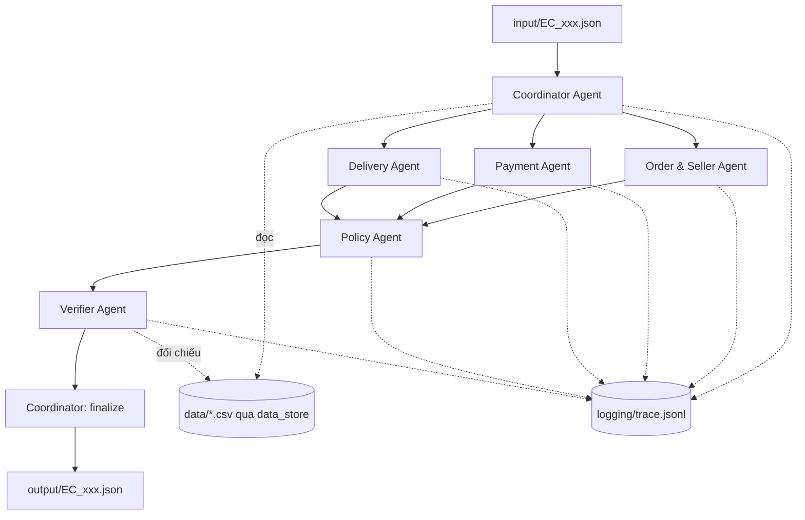

# Kiến trúc hệ thống multi-agent

> Trạng thái: chạy thật end-to-end 50/50 case. Toàn bộ phép tính nghiệp vụ nằm trong
> code tất định; LLM là lớp xác nhận độc lập, không quyết định con số. Mục 5 ghi rõ
> phần nào đã kiểm chứng và kiểm bằng gì.

## 1. Sơ đồ agent

Ba domain agent chạy song song trên cùng một nhánh fan-out của LangGraph, hội tụ tại
Policy Agent.

Bản vẽ đầy đủ (kèm tầng dữ liệu, quyền đọc CSV và luồng trace):
[kien-truc-multi-agent.drawio](kien-truc-multi-agent.drawio) —
xem nhanh bằng [kien-truc-multi-agent.svg](kien-truc-multi-agent.svg).
Nguồn YAML tái tạo lại được nằm ở `.drawio-tmp/kien-truc-multi-agent/`.

## 2. Vai trò và quyền truy cập

| Agent | File | Đọc được gì | Ghi vào state | Được gọi LLM |
| --- | --- | --- | --- | --- |
| Coordinator | [src/agents/coordinator.py](src/agents/coordinator.py) | `input/`, toàn bộ CSV qua `data_store` | `case_id`, `order_id`, `bundle_view` | Không (thuần điều phối) |
| Order & Seller | [src/agents/order_seller.py](src/agents/order_seller.py) | `bundle_view.order_status`, `.items`, `.timestamps.order_delivered_carrier_date` | `findings.order_seller` | Có — xác nhận danh sách seller trễ hạn |
| Payment | [src/agents/payment.py](src/agents/payment.py) | `bundle_view.payments`, `.totals` | `findings.payment` | Có — xác nhận kết luận đối soát |
| Delivery | [src/agents/delivery.py](src/agents/delivery.py) | `bundle_view.timestamps` | `findings.delivery` | Có — xác nhận đơn có trễ hạn |
| Policy | [src/agents/policy.py](src/agents/policy.py) | chỉ `findings` + `bundle_view.totals` | `draft` | Có — ý kiến độc lập về `primary_issue` |
| Verifier | [src/agents/verifier.py](src/agents/verifier.py) | `draft` + `bundle_view` (để đối chiếu evidence) | `verification` | Không (kiểm tra tất định) |

Nguyên tắc phân quyền: chỉ Coordinator chạm vào CSV thô. Các domain agent nhận đúng
lát cắt dữ liệu của mình qua `bundle_view`. Policy Agent **không** được đọc lại CSV —
nó chỉ kết luận trên bằng chứng do các agent khác bàn giao, nên nếu một agent không
tìm thấy bằng chứng thì Policy không thể tự bịa ra sự kiện.

## 3. Luồng handoff

1. **Coordinator** đọc case, lấy `claimed_order_id`, dựng `OrderBundle` từ 4 bảng
   (orders, order_items, order_payments, customers) rồi phát `bundle_view` cho 3 domain agent.
2. **Order & Seller** trả trạng thái đơn, danh sách seller và seller nào bàn giao sau
   `shipping_limit_date`.
3. **Payment** đối soát tổng payment với `item_total + freight_total`, sai số `0.10 BRL`,
   và đánh dấu đơn có nhiều payment row.
4. **Delivery** so `order_delivered_customer_date` với `order_estimated_delivery_date`.
5. Ba finding hội tụ vào `state.findings` qua reducer `merge_findings`
   ([src/state.py](src/state.py)). **Policy** duyệt `ISSUE_PRIORITY` theo đúng thứ tự ưu
   tiên của `EC_POLICY_V1`, chọn `primary_issue`, suy ra root cause / responsible party /
   refund / action từ bảng mapping trong [src/schema.py](src/schema.py).
6. **Verifier** validate schema bằng pydantic, kiểm giới hạn số lượng ID, kiểm định dạng
   evidence bằng regex và kiểm evidence có thật trong dữ liệu của order đó, kiểm tính nhất
   quán refund ↔ case_status ↔ action.
7. **Coordinator finalize** ghi kết luận vào trace; `src/main.py` ghi file JSON.

### Vai trò của LLM

Rule engine trong code quyết `primary_issue`, refund, evidence và entity — tất định,
không trôi theo model. Mỗi agent gọi thêm LLM trên **cùng** lát dữ liệu để tự kết luận
độc lập; kết quả chỉ dùng hai việc: ghi `llm_notes` diễn giải bằng lời, và bỏ phiếu
đồng thuận để hiệu chỉnh `confidence`
(`BASE_CONFIDENCE ± AGREE_BONUS / DISAGREE_PENALTY` trong `policy.py`). LLM lỗi hay
bất đồng thì kết luận nghiệp vụ vẫn đứng nguyên, chỉ `confidence` giảm — đúng ý nghĩa
của trường này. Cờ `--no-llm` cho phép chạy riêng rule engine để smoke test offline.

### Trace

- `logging/trace.jsonl` — **đúng 1 dòng cho mỗi case** (50 dòng cho lượt chạy đầy đủ).
  Mỗi dòng gồm `run_id`, `case_id`, `order_id`, `model`, `agent_path`, `n_llm_calls`,
  `result`, và mảng `steps` gói trọn chuỗi handoff của case đó.
- `logging/trace_events.jsonl` — stream sự kiện thô ghi ngay lúc chạy, dùng để debug.

Cả hai bị ghi đè ở đầu mỗi lượt `--all` (`reset_trace`), không append.

## 4. Chống bịa dữ liệu

- Evidence ID chỉ được dựng bằng các helper `ev_order` / `ev_item` / `ev_payment` /
  `ev_seller` / `ev_policy` trong `schema.py`, không nối chuỗi thủ công.
- Verifier đối chiếu từng evidence với tập ID dựng trực tiếp từ CSV của order đó; ID lạ
  bị đánh dấu `evidence_not_in_data`.
- Order không có item row: `item_ids`, `seller_ids` rỗng và hai khoản tiền bằng `0.0`.
- Timestamp so sánh nguyên giá trị trong CSV, không đổi múi giờ.

## 5. Trạng thái kiểm chứng

Ngoài Verifier chạy trong pipeline, repo có thêm một **validator độc lập**
[tools/validate_output.py](tools/validate_output.py): không import `src/`, không gọi LLM,
đọc thẳng CSV bằng pandas và tự suy đáp án cho từng case rồi so với `output/`. Hai đường
tính hoàn toàn tách nhau, nên nếu rule engine hiểu sai đề thì validator bắt được.

| Thành phần | Trạng thái | Bằng chứng |
| --- | --- | --- |
| Nạp CSV, dựng `OrderBundle`, tính tổng tiền | Đã chạy thật | `py -3 -m src.main --all` ghi đủ 50 file |
| Graph LangGraph fan-out/fan-in | Đã chạy thật | 50/50 case chạy hết 7 node, `agent_path` trong `trace.jsonl` |
| Logic phân loại `primary_issue` | Đã cài, đã đối chiếu | validator độc lập khớp 50/50; phân bố 8/8/8/8/9/9 trên 6 quy tắc |
| Thứ tự ưu tiên quy tắc | Đã kiểm | EC_008 vừa `canceled` vừa có seller trễ hạn → chọn `canceled_order_paid` |
| Tính refund và tổng tiền | Đã cài, đã đối chiếu | validator so từng khoản với tổng tính lại từ CSV, sai số < 0.005 BRL |
| Evidence ID | Đã cài, đã đối chiếu | validator join lại từng ID về CSV; 0 false positive, 0 sai định dạng, 0 trùng |
| Order không có item row | Đã kiểm | 8 case `unavailable` có `item_ids`/`seller_ids` rỗng, hai khoản tiền `0.0` |
| Verifier trong pipeline | Đã cài, đã chạy | 50/50 case `ok: true` trong `trace.jsonl` |

## 6. Model và runtime

Khai báo trong [src/config.py](src/config.py), ghi lại tự động vào `logging/metadata.json`
khi chạy `--all`. Trần tham số `10B` được cưỡng chế ngay lúc khởi tạo `ModelSpec`.

| Provider | Model | Params |
| --- | --- | --- |
| groq | `llama-3.1-8b-instant` | 8B |
| openrouter | `meta-llama/llama-3.1-8b-instruct` | 8B |
