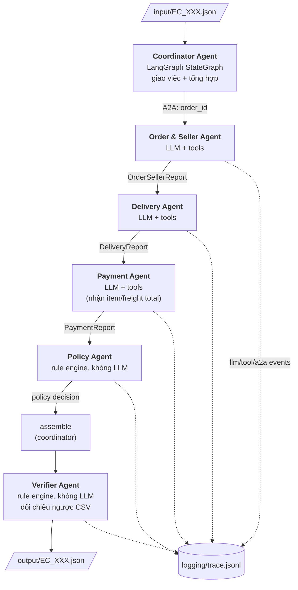

# Kiến trúc Multi-Agent — EC Dispute Resolution (EC_POLICY_V1)

Hệ thống điều tra 50 khiếu nại thương mại điện tử trên dữ liệu Olist bằng 6 agent
chuyên trách. Mỗi agent sở hữu một domain dữ liệu riêng, trao kết quả cho agent kế
tiếp qua một message envelope kiểu A2A, và toàn bộ kết luận cuối cùng phải đi qua
một agent kiểm chứng trước khi ghi ra `output/`.

Nguyên tắc xuyên suốt: **dữ liệu kiểm chứng được thắng lời khiếu nại**. Không agent
nào được tự suy diễn sự kiện không có trong CSV.

## 1. Sơ đồ agent



Đồ thị được định nghĩa trong `build_graph()` tại [src/coordinator_agent/graph.py](src/coordinator_agent/graph.py):
`START → order_and_seller_agent → delivery_agent → payment_agent → policy_agent → assemble → verifier_agent → END`.

## 2. Vai trò từng agent

| Agent | File | Loại | Quyết định gì |
| --- | --- | --- | --- |
| Coordinator | [src/coordinator_agent/graph.py](src/coordinator_agent/graph.py) | orchestrator | Đọc case, phát A2A request cho từng agent, ráp `CaseOutput`, ghi file |
| Order & Seller | [src/order_and_seller_agent/agent.py](src/order_and_seller_agent/agent.py) | LLM + tools | `order_status`, danh sách item/seller, seller nào bàn giao sau `shipping_limit_date`, tổng item + freight |
| Delivery | [src/delivery_agent/agent.py](src/delivery_agent/agent.py) | LLM + tools | Giao thực tế có muộn hơn `order_estimated_delivery_date` không |
| Payment | [src/payment_agent/agent.py](src/payment_agent/agent.py) | LLM + tools | Tổng payment, số payment row, có khớp item + freight trong sai số 0.10 BRL không |
| Policy | [src/policy_agent/agent.py](src/policy_agent/agent.py) | rule engine | Áp bảng EC_POLICY_V1 theo đúng thứ tự ưu tiên: `primary_issue`, `cause_code`, responsible party, refund, action, confidence |
| Verifier | [src/verifier_agent/agent.py](src/verifier_agent/agent.py) | rule engine | Dựng lại entity + evidence + tiền từ CSV, siết giới hạn schema, sửa mọi sai lệch trước khi ghi file |

### Ranh giới deterministic

Ba agent dữ liệu dùng `create_agent` (LangChain) với `response_format` là Pydantic
model, nên output luôn là JSON có schema — nhưng **mọi con số đều do tool tính bằng
Python**, LLM chỉ chép lại. Hai agent còn lại (Policy, Verifier) không gọi model lần
nào: bảng rule của đề là tra cứu chính xác, và khâu kiểm chứng cuối không được phép
có tính ngẫu nhiên.

## 3. Quyền truy cập dữ liệu

Mỗi agent chỉ đọc đúng phần dữ liệu thuộc domain của mình, qua các accessor dùng
chung trong [src/data_store.py](src/data_store.py) (`get_order`, `get_order_items`,
`get_payments`, `get_seller`).

| Agent | orders | order_items | order_payments | sellers | input/output JSON |
| --- | :-: | :-: | :-: | :-: | :-: |
| Coordinator | – | – | – | – | đọc + ghi |
| Order & Seller | ✔ | ✔ | – | ✔ | – |
| Delivery | ✔ (chỉ cột thời gian) | – | – | – | – |
| Payment | – | – | ✔ | – | – |
| Policy | – | – | – | – | – |
| Verifier | ✔ | ✔ | ✔ | ✔ | – |

Payment Agent **không** đọc `order_items`: tổng item + freight được Order & Seller
Agent bàn giao qua A2A message, đúng tinh thần phối hợp giữa các bộ phận. Policy
Agent không chạm vào CSV — nó chỉ được nhìn thấy structured report, nên không thể
bịa ra dữ liệu mới. Verifier là agent duy nhất được đọc toàn bộ, vì nhiệm vụ của nó
là đối chiếu chéo.

## 4. Giao thức A2A

Envelope định nghĩa tại [src/a2a_protocol.py](src/a2a_protocol.py):

```python
class A2AMessage(BaseModel):
    task_id: str          # = case_id
    from_agent: str
    to_agent: str
    role: Literal["request", "response"]
    data: dict[str, Any]  # payload = model_dump() của một *Report
    evidence_ids: list[str]
    notes: str
```

Đây là bản rút gọn in-process của Agent2Agent protocol: giữ nguyên khái niệm task
id, chiều gửi/nhận và structured data part, nhưng không chạy 6 HTTP server riêng —
chi phí điều phối process và độ trễ mạng không đem lại giá trị nào cho bài toán
batch 50 case.

Mọi handoff đều đi qua envelope này chứ không truyền dict trần, nên hai đầu của mỗi
lần trao đổi đều được ghi log và có thể kiểm chứng lại từ trace.

### Luồng handoff cho một case

| # | From | To | Payload chính |
| --- | --- | --- | --- |
| 1 | coordinator | order_and_seller | `{order_id}` |
| 2 | order_and_seller | coordinator | `OrderSellerReport` (status, item/seller ids, `late_seller_ids`, totals) |
| 3 | coordinator | delivery | `{order_id}` |
| 4 | delivery | coordinator | `DeliveryReport` (`delivered_late`, hai mốc thời gian) |
| 5 | coordinator | payment | `{order_id, item_total_brl, freight_total_brl}` ← kết quả bước 2 |
| 6 | payment | coordinator | `PaymentReport` (`payment_total_brl`, `payment_count`, `matches_item_freight`) |
| 7 | coordinator | policy | 3 report + `opened_at` |
| 8 | policy | coordinator | quyết định: issue, cause code, parties, refund, actions, confidence |
| 9 | coordinator | verifier | `CaseOutput` tạm + `order_id` + quyết định |
| 10 | verifier | coordinator | `CaseOutput` đã kiểm chứng và sửa |

Schema của các report nằm trong [src/schemas.py](src/schemas.py).

## 5. Cơ chế kiểm chứng

Verifier không tin bất kỳ giá trị nào do LLM báo lên. Với mỗi case nó dựng lại từ CSV:

- **Affected entities** — item/seller/payment ids lấy trực tiếp từ `order_items` và
  `order_payments`, xếp hạng theo mức liên quan tới nguyên nhân gốc (item và seller
  bị quy trách nhiệm đứng trước) rồi mới cắt còn 5. Order id không tồn tại trong
  `orders.csv` thì không được phát ra.
- **Evidence ids** — dựng bởi [src/verifier_agent/evidence.py](src/verifier_agent/evidence.py)
  theo thứ tự ưu tiên `order:` → `policy:` → item/seller liên quan → `payment:` →
  phần còn lại, rồi mới cắt còn 10. Nhờ vậy giới hạn 10 chỉ có thể loại bỏ bằng
  chứng ít quan trọng nhất; trước đây `policy:` bị nối vào cuối nên là thứ bị mất
  đầu tiên trên đơn nhiều item.
- **Tài chính** — `item_total_brl`, `freight_total_brl`, `payment_total_brl` tính lại
  từ CSV; `recommended_refund_brl` suy ra lại từ chính các tổng đó theo loại issue,
  nên không thể lệch với bảng rule.
- **Giới hạn schema** — 5 id mỗi entity set, 10 evidence, 3 cause, 3 party, 5 action,
  `confidence ∈ [0,1]`, `case_status` nhất quán với refund.

Mọi lần sửa được ghi vào trace dưới event `verifier_corrections`.

`Config.EVIDENCE_MODE` trong [src/config.py](src/config.py) chọn cách cấu thành evidence:
`FULL` (mọi id tồn tại) hoặc `CAUSAL` (chỉ id mà nguyên nhân gốc thực sự liên đới —
bỏ `seller:` khi seller không có lỗi, bỏ `item:` với case lỗi nền tảng).

## 6. Quan sát và trace

[src/tracer.py](src/tracer.py) cài một `BaseCallbackHandler` cho từng agent, nên
không agent nào phải tự ghi log. `logging/trace.jsonl` được ghi mới mỗi lần chạy
(README yêu cầu chỉ giữ lượt chạy gần nhất) với các event:

| Event | Ghi nhận |
| --- | --- |
| `case_start` / `case_end` | Ranh giới mỗi case |
| `a2a_receive` / `a2a_send` | Envelope đầy đủ mỗi lần handoff: from, to, role, data, evidence |
| `llm_start` / `llm_end` | Prompt, output, và `input_tokens` / `output_tokens` mỗi lần gọi model |
| `tool_start` / `tool_end` / `tool_error` | Từng tool call kèm tham số và kết quả |
| `policy_decision` | Quyết định của rule engine |
| `verifier_corrections` / `verifier_ok` | Những gì khâu kiểm chứng phải sửa |

Token cộng dồn theo từng agent và được ghi vào `logging/metadata.json` cùng model,
framework và runtime.

## 7. Chạy hệ thống

```bash
uv run python main.py                      
# 50 case -> output/, trace, metadata
```

`scripts/edge_case_check.py` nạp thẳng các order id nằm ngoài phạm vi 50 case chính
thức — đơn 21 item, đơn 29 payment row, đơn nhiều seller giao trễ, đơn `shipped`
chưa từng giao và đã quá hạn, đơn `canceled` không có payment, và một order id không
tồn tại — rồi kiểm tra output vẫn đúng schema và không mất bằng chứng `policy:`.
